# Atlas — Enterprise Software Intelligence

> Discover. Understand. Secure. Modernize.

[](https://github.com/fsqBr/atlas/actions/workflows/ci.yml)
[](https://github.com/fsqBr/atlas/releases)
[](LICENSE)

Atlas is a self-hosted platform that assesses .NET codebases **without running them**: it reads the source as data,
builds an inventory, finds security, privacy, quality, architecture and modernization problems, scores the health of
each system, compares six modernization strategies with effort/cost ranges and a roadmap, and produces a client-ready
executive report. An optional AI layer — with *your* key or a local model — explains findings, drafts fixes, recovers
business rules from code and writes the executive summary and migration plan.

It is built for consultancies and platform teams that need an evidence-based answer to "what do we have, how bad is
it, and what would it take to modernize it?" across a portfolio of legacy applications.

---

## Screenshots

| Portfolio dashboard | Assessment overview |
|---|---|
| 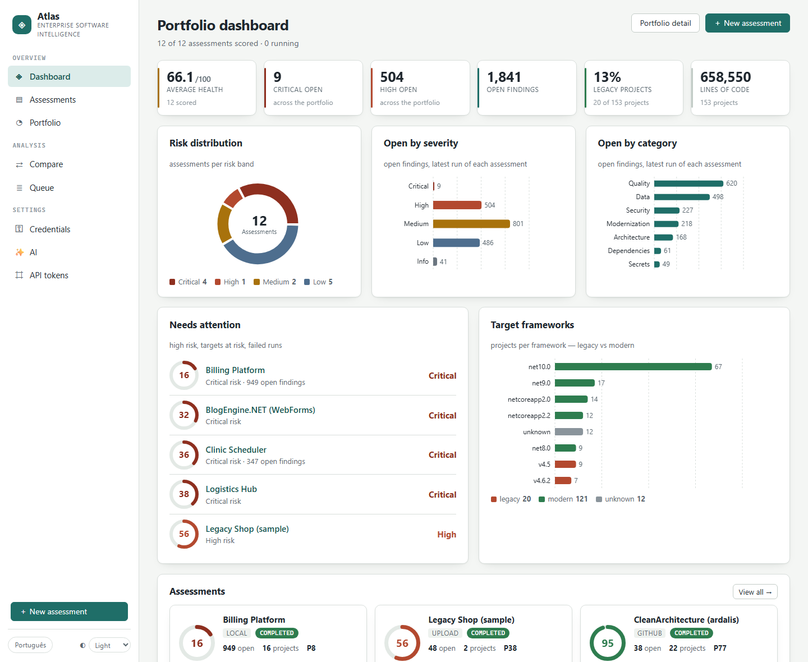 | 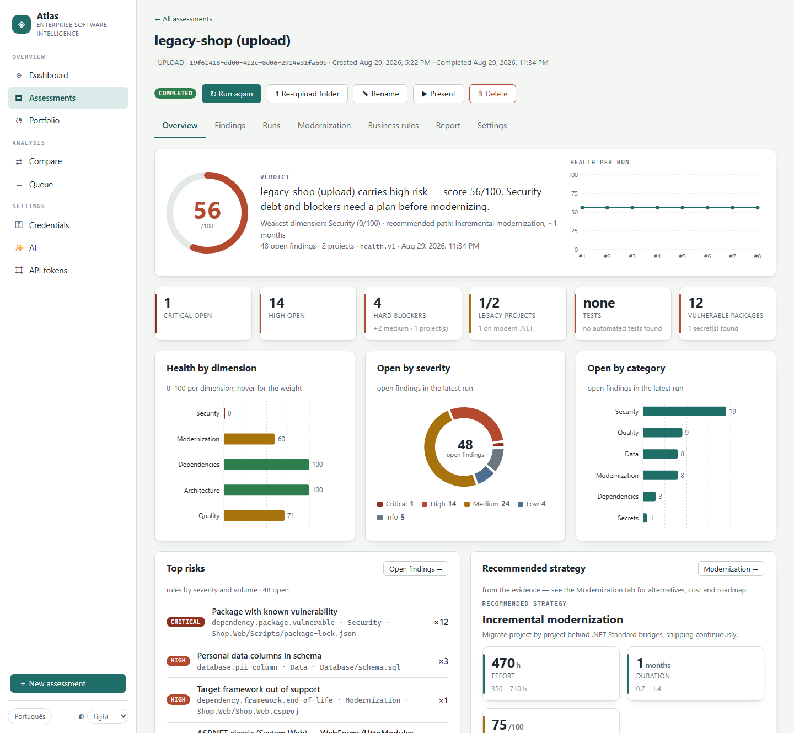 |

| Findings | Modernization strategies, effort and roadmap |
|---|---|
| 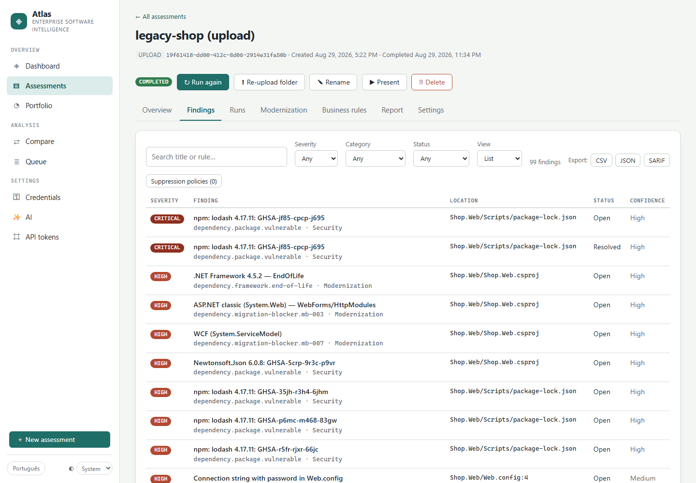 | 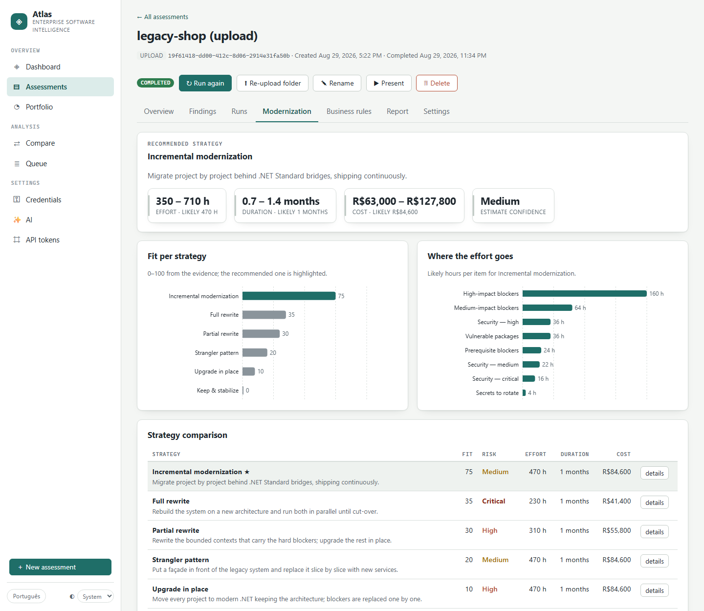 |

| Compare two assessments | Portfolio benchmark |
|---|---|
| 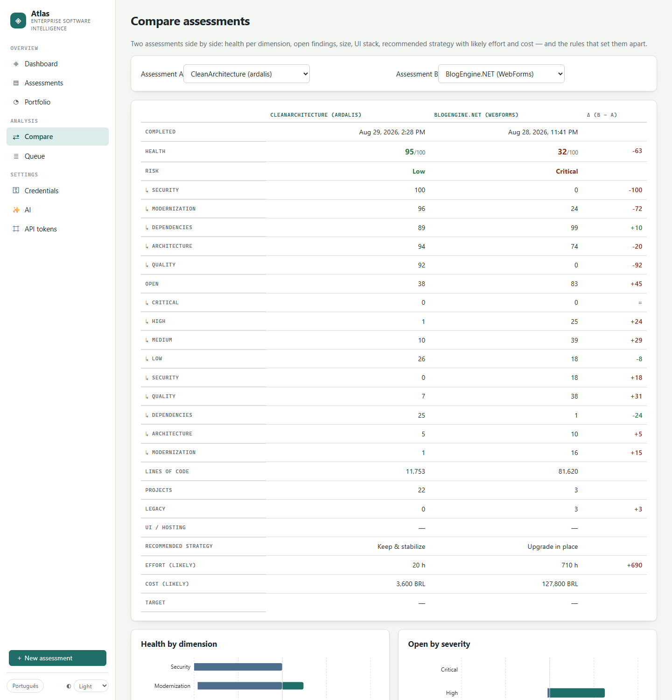 | 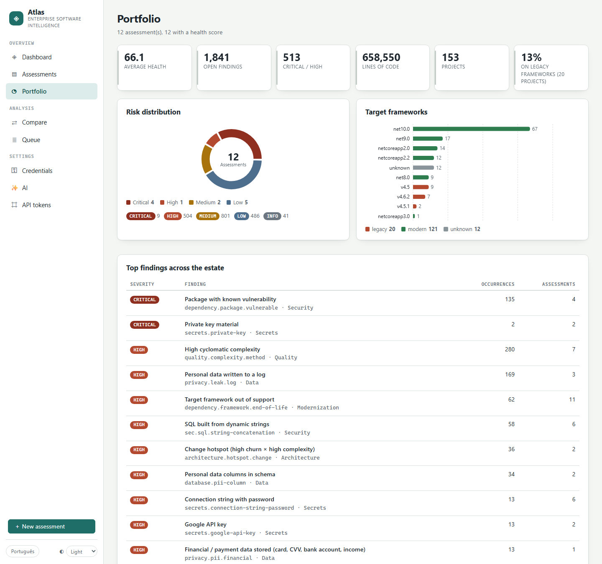 |

Dark theme is one click away: 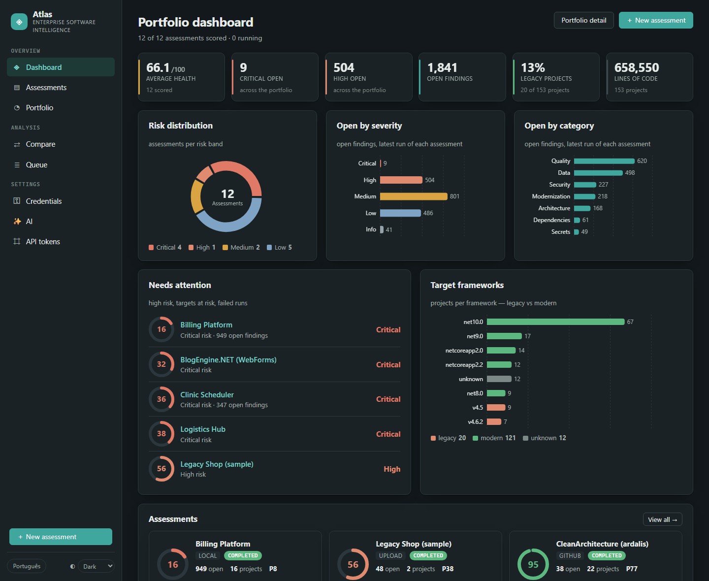

### AI in action (bring your own key)

| Business rules recovered from code | Fix suggested as a diff, explanation on the finding |
|---|---|
| 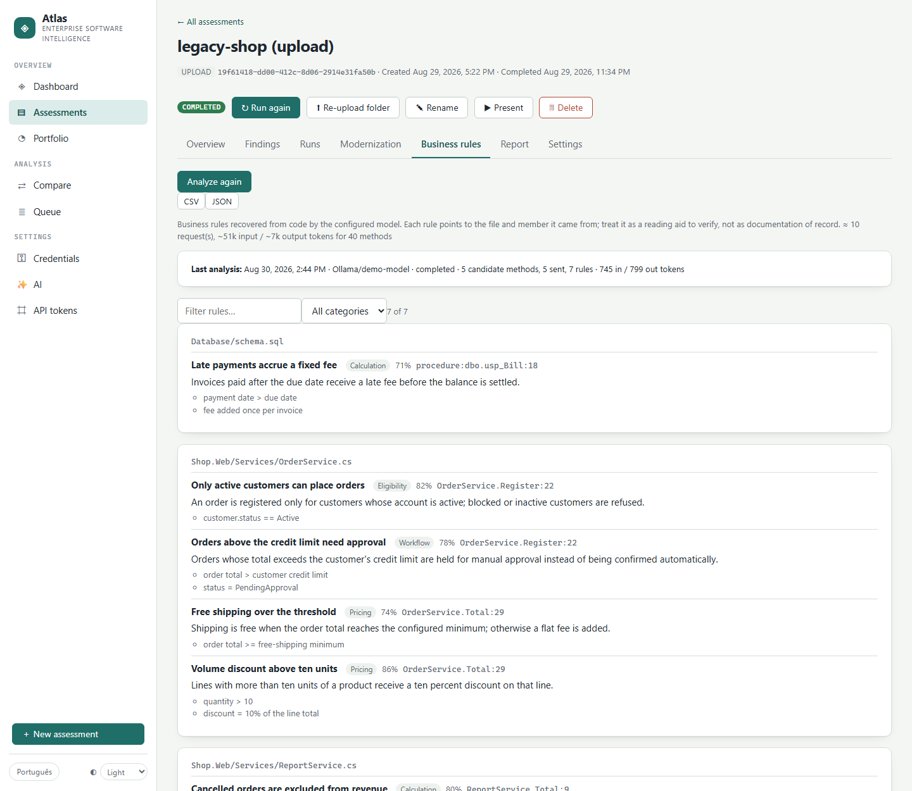 | 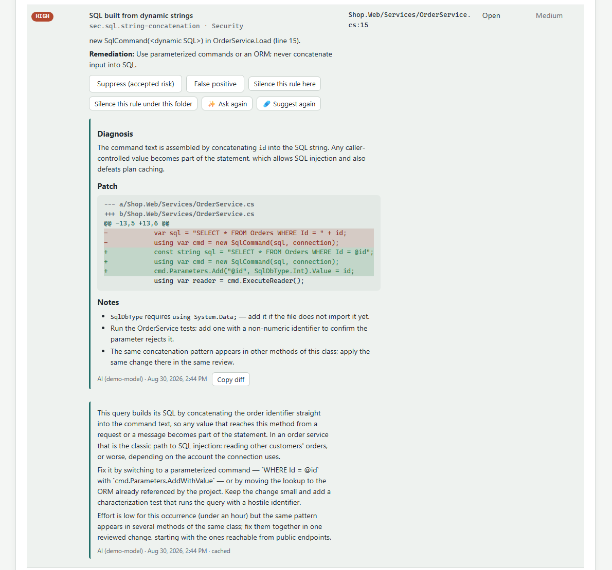 |

| Migration plan drafted from the deterministic plan | Provider settings — nothing is sent until enabled |
|---|---|
| 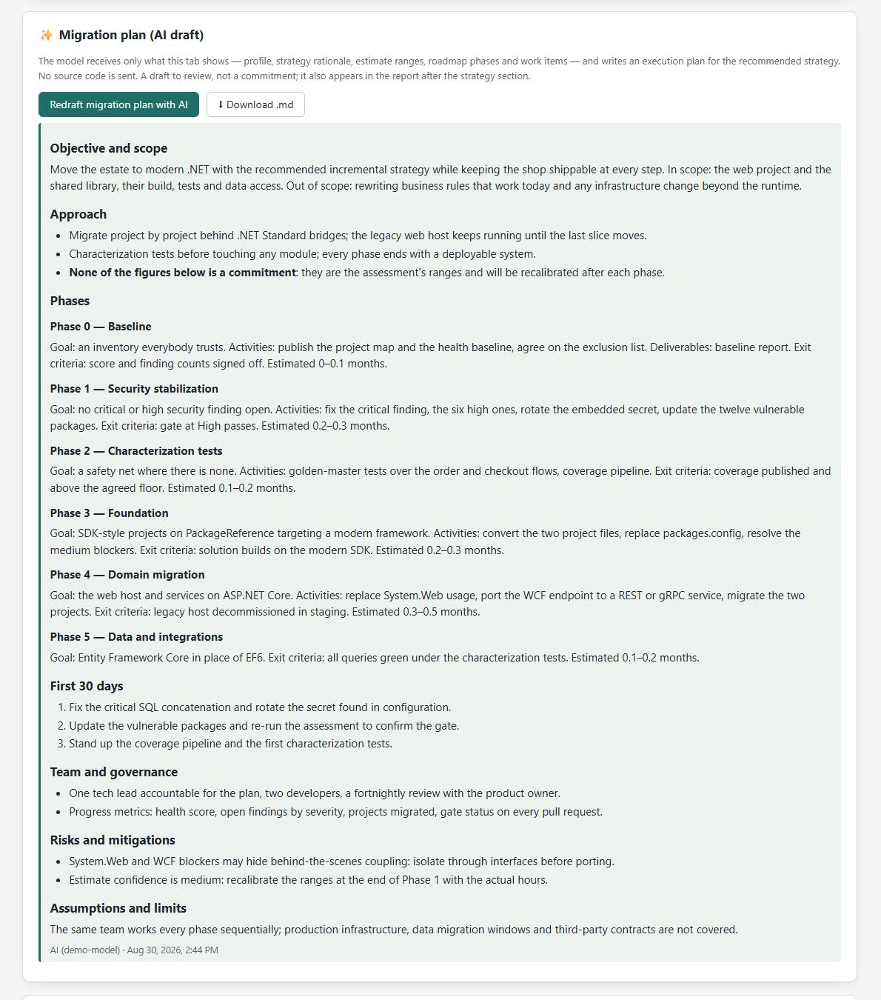 | 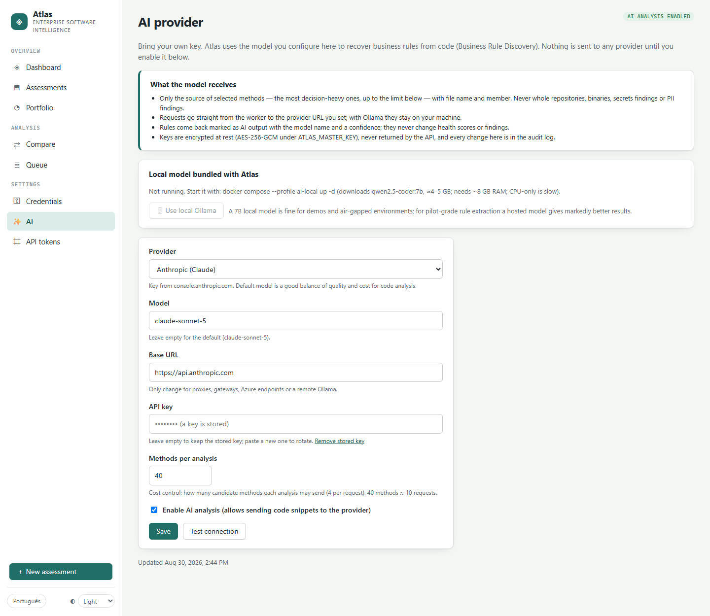 |

The AI screenshots were produced with a stand-in model (`demo-model`) answering the same prompts Atlas sends; a
hosted model's answers are richer, the guard rails (only snippets, never secrets, always labelled) are identical.

The screenshots show the bundled sample corpus and public open-source repositories (BlogEngine.NET, CleanArchitecture);
the remaining assessments are anonymized demo entries.

---

## Table of contents

1. [Screenshots](#screenshots)
2. [What Atlas does](#what-atlas-does)
3. [How it works](#how-it-works)
4. [Quick start](#quick-start) · [Try it with the bundled sample](#try-it-with-the-bundled-sample)
5. [Your first assessment](#your-first-assessment)
6. [Sources: folders, uploads and git](#sources-folders-uploads-and-git)
7. [What gets analyzed](#what-gets-analyzed)
8. [Health score, strategies, cost and roadmap](#health-score-strategies-cost-and-roadmap)
9. [Reports and exports](#reports-and-exports)
10. [AI features (bring your own key)](#ai-features-bring-your-own-key)
11. [Web UI](#web-ui)
12. [CI integration and quality gate](#ci-integration-and-quality-gate)
13. [Security and privacy](#security-and-privacy)
14. [Configuration reference](#configuration-reference)
15. [Operations](#operations)
16. [Development](#development)
17. [FAQ](#faq)
18. [Status and limits](#status-and-limits)
19. [Contributing and support](#contributing-and-support)
20. [License](#license)

---

## What Atlas does

- **Inventory** — solutions, projects, target frameworks, project format (SDK-style or legacy), UI/hosting framework
  (WebForms, MVC 5, Web API 2, ASP.NET Core, Blazor, WinForms, WPF, MAUI, WCF, Windows service…), NuGet and npm
  dependencies, database footprint (DDL, EF migrations, EDMX), front-end frameworks, test projects and coverage reports.
- **Findings** in seven categories — Security, Secrets, Data (personal data), Quality, Architecture, Modernization,
  Dependencies — each with severity, confidence, location, remediation and a stable fingerprint across runs, so you
  can see what was resolved, what is new and what regressed.
- **Health score** (0–100) with five weighted dimensions and a transparent list of the rules that cost points.
- **Modernization analysis** — six strategies (keep & stabilize, upgrade in place, incremental, strangler, partial
  rewrite, full rewrite) ranked by fit against the evidence, effort/duration/cost **ranges** with every assumption
  listed, and a phased roadmap with dependencies.
- **Executive report** — HTML and PDF, English or Portuguese, white-label — plus CSV/JSON/SARIF exports, a CycloneDX
  SBOM with license classes, and a Markdown migration plan.
- **Portfolio view** — every system side by side: risk distribution, benchmark quartiles, targets, top rules across the
  estate, and a two-assessment comparison.
- **Triage** — suppressions with reason and author, false positives, standing policies per rule/path, scope
  exclusions, full audit trail.
- **Automation** — scheduled re-runs, signed webhooks, API tokens, a CI quality gate with ready-made GitHub Action,
  Azure DevOps and GitLab CI templates, and Slack/Teams notifications for completed runs.
- **AI assistance (opt-in)** — explain a finding, suggest a fix as a unified diff, recover business rules from the
  most decision-heavy methods, write the executive summary and draft a migration plan. Anthropic, OpenAI, Azure
  OpenAI or a local Ollama; nothing leaves your environment until an administrator switches it on.

## How it works

```
 browser ──► atlas-web (nginx + React SPA) ──► atlas-api (ASP.NET Core)
                                                  │  orchestration, REST API, reports, OSV sync, scheduler
                                                  ▼
                                            PostgreSQL ◄──── atlas-worker (job queue consumer)
                                                  ▲            materializes sources, runs language analysis
                                            MinIO / volumes    and scanners in a disposable child process
                                                  ▲
                                            atlas-pdf (Gotenberg: HTML → PDF, no port published)
```

- **Analysis never executes customer code.** Source is parsed with Roslyn (C#, VB.NET), text parsers (SQL,
  JavaScript/TypeScript, configuration, Dockerfiles, lockfiles) and project-file readers. C# is analyzed at "Tier 1.75"
  by default — Roslyn compilations assembled from the source trees plus bundled reference assemblies, no build, no
  restore. An opt-in Tier 2 runs `dotnet restore` inside the scan sandbox for a real API surface.
- **The worker has no internet access.** Vulnerability data (OSV, NuGet + npm) is synced by the API into a shared
  volume; license metadata lookups and AI calls are the only other outbound calls and both are configurable/opt-in.
- **Every run is isolated.** Scans execute in a disposable child process with a heap cap and a wall-clock timeout; a
  crash or hang fails that run, not the worker. Jobs are leased from a PostgreSQL queue and retried a bounded number
  of times before dead-lettering.
- **Findings are facts first.** Deterministic engines produce inventory, findings, score, strategy, cost and roadmap;
  the AI layer only ever writes prose or proposals *about* those facts and is always labelled as such.

## Quick start

Requirements: Docker Desktop (Windows/macOS) or Docker Engine (Linux) with Compose v2, about 4 GB of RAM for the
stack (8 GB+ with the local AI model), ports **3000** (web) and **8080** (API) free, and a folder with .NET code to look
at — or use the bundled sample below. Nothing else: the .NET SDK and Node are only needed to *develop* Atlas; the
containers build everything.

```bash
git clone https://github.com/fsqBr/atlas.git
cd atlas
cp .env.example .env # then edit .env — see below

# fastest path: pull the published images (no build)
docker compose -f docker-compose.yml -f docker-compose.images.yml up -d

# or build from source (first build takes 5–10 minutes; needed for Tier 2's SDK worker image)
docker compose up -d
```

In `.env`, replace the four `change-me` values and point the source root at the parent folder of your repositories:

| Key | What to put there |
|---|---|
| `ATLAS_DB_PASSWORD`, `ATLAS_MINIO_PASSWORD` | Any strong password |
| `ATLAS_SECRETS_HMAC_KEY`, `ATLAS_MASTER_KEY` | 32 random bytes, base64. Linux/macOS: `openssl rand -base64 32`. Windows PowerShell: `[Convert]::ToBase64String((1..32 \| ForEach-Object { Get-Random -Maximum 256 }) -as [byte[]])` |
| `ATLAS_LOCAL_SOURCES` | The folder *containing* your repositories, e.g. `/home/me/src` or `C:/Users/me/source/repos` (forward slashes on Windows). Up to three roots (`_2`, `_3`). |

Open **http://localhost:3000**. The API is at `http://localhost:8080` (`/health/ready`, `/api/...`, Prometheus
`/metrics`). Migrations run automatically when the API starts. To upgrade later: `git pull && docker compose up -d --build`.

**Windows notes.** Use Docker Desktop with the WSL 2 backend and make sure the drive holding your repositories is
shared with Docker (Settings → Resources → File sharing); write paths with forward slashes. Everything else is the
same — the stack itself runs in Linux containers.

### Try it with the bundled sample

The repository ships a deliberately legacy .NET shop used by the regression tests — WebForms, WCF, EF6, SQL built
from strings, a hard-coded connection string, vulnerable packages, a Dockerfile on an end-of-life image. Point the
source root at it and you have a realistic assessment in under a minute:

```bash
# in .env
ATLAS_LOCAL_SOURCES=./tests/Atlas.IntegrationTests/Corpus
```

Then *New assessment → Local folder*, click the root chip, pick `legacy-shop` (folders with .NET projects are marked),
**Start assessment**, and open the report when the run completes — about ten seconds. Everything in the screenshots
above comes from that sample.

### Troubleshooting

| Symptom | Cause / fix |
|---|---|
| `docker compose up` stops with *define ATLAS_… in .env* | A `change-me` value is still in `.env` (compose refuses to start with placeholders). |
| Port 3000 or 8080 already in use | Add a `docker-compose.override.yml` with `services: atlas-web: ports: ["3001:80"]` (and `atlas-api: ports: ["8081:8080"]`), then `docker compose up -d`. |
| *Local folder* shows no folders | `ATLAS_LOCAL_SOURCES` must be the **parent** of your repositories, the path must exist on the host, and Docker must be allowed to share that drive. Mounts are read at container start: `docker compose up -d` after changing `.env`. |
| *Folder on my computer* is disabled | The browser has no directory picker (use Chrome or Edge), or the page is not served over `localhost`/HTTPS. |
| A run stays *Queued* | The worker is not running: `docker compose ps`, `docker compose logs atlas-worker`. |
| PDF download fails | The `atlas-pdf` (Gotenberg) container is not up; the HTML report still works. |
| Something else | `docker compose logs -f atlas-api atlas-worker` — errors are logged with the assessment and job ids; [docs/runbook.md](docs/runbook.md) covers sizing, upgrades and backups. |

Optional extras:

```bash
# local AI model (Ollama inside the deployment; ~4.7 GB download, CPU inference is slow)
docker compose --profile ai-local up -d

# Tier 2 analysis (dotnet restore inside the sandbox) — needs the SDK worker image
docker compose build --build-arg ATLAS_WORKER_BASE=mcr.microsoft.com/dotnet/sdk:10.0 atlas-worker
echo ATLAS_TIER2_ENABLED=true >> .env && docker compose up -d atlas-worker
```

Kubernetes: `deploy/helm/atlas` deploys the same topology (bundled PostgreSQL/MinIO for pilots or managed services
for production, RWX volumes for uploads and vulnerability data, NetworkPolicy, non-root read-only pods). See
[docs/runbook.md](docs/runbook.md) for installation, upgrade, backup and troubleshooting.

## Your first assessment

1. **New assessment** → choose a source: a folder under one of the mounted roots (folder picker), a folder on your
   machine (zipped in the browser and uploaded — `bin/`, `obj/`, `node_modules/`, `.git/` skipped), or a git URL /
   GitHub / Azure DevOps / GitLab locator (with a stored credential for private repositories).
2. The run is queued; the page follows it live. A typical repository of a few hundred files takes seconds to a couple
   of minutes.
3. **Overview** shows the score with a verdict, the trend over runs, the numbers that matter and the recommended
   strategy. **Findings** lists everything with filters, triage and views by rule and by folder. **Modernization**
   compares strategies, effort and cost and shows the roadmap. **Report** opens the executive report (HTML) and
   downloads the PDF and the SBOM.
4. Run again after changes: findings are reconciled by fingerprint, so the run comparison shows resolved / new /
   regressed and the health delta.

From the API:

```bash
curl -s -X POST http://localhost:8080/api/assessments -H 'Content-Type: application/json' \
  -d '{"name":"Billing platform","sourceKind":"local","sourceLocator":"/sources/billing"}'
# → {"id":"…","jobId":"…"}
curl -s http://localhost:8080/api/assessments/<id>/health
curl -s http://localhost:8080/api/assessments/<id>/report?lang=en -o report.html
```

## Sources: folders, uploads and git

| Kind | Locator | Notes |
|---|---|---|
| `local` | `/sources/<folder>` | Up to three host folders mounted read-only (`ATLAS_LOCAL_SOURCES`, `_2`, `_3`); the UI browses them one level at a time and refuses paths outside the roots. Folders are borrowed: never written to. |
| `upload` | (created by the UI) | Browser zips the folder and posts it to `POST /api/uploads`; the archive lives on the `atlas-uploads` volume with zip-slip protection and size caps; re-upload keeps history. Orphan archives are garbage-collected. |
| `git` | any clone URL | Shallow clone (`--shallow-since` when history is wanted for churn analysis). Credentials are passed to git through the environment, never on the command line or URL. |
| `github` | `owner` or `owner/repo` | `POST /api/sources/discover` lists repositories to create assessments in batch. GitHub Enterprise Server via `Atlas:Connectors:GitHub:{ApiBaseUrl,WebBaseUrl}`. |
| `azure-devops` | `org/project[/repo]` | Same discovery flow; Azure DevOps Server via `Atlas:Connectors:AzureDevOps:BaseUrl`. |
| `gitlab` | `group[/subgroup[/project]]` | Subgroups included; self-managed via `Atlas:Connectors:GitLab:BaseUrl`. |

Private repositories: store a token under **Credentials** (or `PUT /api/credentials/{name}`) — encrypted with
AES-256-GCM under `ATLAS_MASTER_KEY`, never returned by the API — and pick it when creating the assessment.
`Atlas:Connectors:Git:AllowedHosts` restricts which hosts the worker may clone from; URLs with embedded credentials are
always refused.

## What gets analyzed

| Scanner | Rules (prefix) | What it looks at |
|---|---|---|
| Dependencies | `dependency.*` | NuGet (project files, `packages.config`) and npm (`package-lock.json` v1–v3) against the OSV vulnerability export; end-of-life target frameworks; migration blockers (System.Web, WCF, Remoting, WF, MSMQ, legacy project format, EF6…) as individual weighted rules |
| Security | `sec.*` | SQL built by concatenation/interpolation, weak hashes, BinaryFormatter and other unsafe deserialization, debug/trace enabled in production configuration, and more |
| Secrets | `secrets.*` | Connection strings with passwords, API keys (cloud providers, Google, Slack…), private key material, tokens in configuration and code |
| Personal data | `privacy.*` | Members whose names indicate identifiers (CPF/CNPJ/passport…), contact, financial, health, credential or birth data; those values flowing into logs or exception messages |
| Quality | `quality.*` | Cyclomatic complexity, duplicated blocks, absent tests, coverage from Cobertura/OpenCover reports, APIs gone or discouraged on modern .NET, `[Obsolete]` usage |
| Architecture | `architecture.*` | Project dependency cycles, high fan-out, change hotspots (churn × complexity) and knowledge silos from git history |
| Database | `database.*` | DDL scripts, EF migrations, EDMX/DBML, versioning tooling; procedures/functions/triggers with dynamic SQL, cursors, `SELECT *`; personal data in column names — all offline |
| Infrastructure | `infra.*` | Dockerfiles (unpinned or EOL base images, root user, secrets in ENV/ARG), compose files (privileged, host network, docker socket), production `appsettings*.json` |
| JavaScript / front end | `javascript.*` | Front-end frameworks from manifests and views, end-of-life ones (AngularJS 1.x, Knockout, Backbone, jQuery 1/2), `eval`, DOM injection, plain-HTTP calls |
| Licenses | `license.*` | Every NuGet/npm dependency classified from registry metadata (permissive, weak/strong copyleft, restricted, unknown); a deny list turns matches into Critical findings; feeds the SBOM |

Languages: **C#** (Roslyn, semantic where symbols resolve), **VB.NET** (Roslyn, syntactic), **SQL** (text parser),
**JavaScript/TypeScript** (text parser). Scope is controlled with an `.atlasignore` at the repository root and
per-assessment exclude paths; vendored, minified and generated code is excluded by default.

## Health score, strategies, cost and roadmap

- **Health** (`health.v1`): five dimensions — Security (incl. secrets and personal data), Modernization, Dependencies,
  Architecture, Quality — each 0–100 with a weight; every point lost is attributed to a rule and count, so the score is
  never a mystery number. Risk bands: Critical < 40, High < 60, Medium < 80, Low otherwise.
- **Strategies** (`modernization.v1`): additive fit scores from framework generation, blockers by weight, UI frameworks
  without an upgrade path, test posture, size, coupling and security debt; rationale, prerequisites, blockers and
  benefits are listed for each.
- **Cost** (`cost.v1`): base effort per KLOC by strategy, plus blockers and security debt, times explicit multipliers,
  widened by confidence into optimistic / likely / conservative hours, months and money. Tune with `Atlas:Cost:*`
  (`TeamSize`, `HourlyRate`, `Currency`, `ProductiveHoursPerDeveloperMonth`, per-KLOC rates, hours per blocker and
  finding, multipliers). Record what a modernization really took (`PUT /api/assessments/{id}/actuals`) and
  `GET /api/calibration` tells you whether the rates should move.
- **Roadmap** (`roadmap.v1`): baseline → security → characterization tests → foundation (SDK-style, PackageReference,
  target framework) → domain migration → data/integrations → retirement, only the phases the evidence calls for, with
  effort shares and dependencies. Shown as a Gantt in the UI and a table in the report.
- **Targets and benchmark**: an assessment can carry a target score and date; the portfolio reports met / on track /
  at risk / missed and shows quartiles (P25/P50/P75) per dimension with each assessment's percentile.
- **History**: the portfolio page charts average health and open findings week by week, recomputed from the runs that
  already happened. The executive report accepts `?since=` (also a picker on the Report tab) to compare against an
  older baseline — "what changed since last month's report" — instead of only the previous run.

## Reports and exports

| What | Where |
|---|---|
| Executive report (HTML) | `GET /api/assessments/{id}/report?lang=en\|pt-BR` — page one with verdict, tiles, what changed and top risks; health, coverage, key risks, modernization, business rules, findings by category, inventory, per-project table, capped appendix |
| PDF | `GET /api/assessments/{id}/report.pdf` — rendered by the Gotenberg sidecar (or a local Chrome/Edge in development); footer with brand, assessment, page numbers. White-label with `Atlas:Report:{BrandName,PreparedBy,LogoDataUri,AccentColor}` |
| Findings | `GET /api/assessments/{id}/findings/export?format=csv\|json\|sarif` (SARIF 2.1.0 for GitHub / Azure DevOps code scanning) |
| SBOM | `GET /api/assessments/{id}/sbom` — CycloneDX 1.5 JSON with purls and license expressions |
| Business rules | `GET /api/assessments/{id}/business-rules/export?format=csv\|json` |
| Migration plan | `GET /api/assessments/{id}/migration-plan/export` — Markdown |
| Run comparison | `GET /api/assessments/{id}/runs/{runId}/compare[?with=]` |
| Two assessments | `GET /api/assessments/compare?a=&b=` |
| Pull-request comment | `GET /api/assessments/{id}/pr-comment?failOn=&minScore=&lang=&ai=` — Markdown |
| Portfolio | `GET /api/portfolio`, `GET /api/calibration`, `GET /api/portfolio/trend?weeks=` |

## AI features (bring your own key)

*Settings → AI* (administrators) selects a provider — **Anthropic**, **OpenAI**, **Azure OpenAI** or **Ollama** —
stores the key encrypted (write-only; never returned), tests the connection and enables AI analysis. Until that
switch is on, nothing is ever sent to any provider. `docker compose --profile ai-local up -d` adds an Ollama container
with a small code model for a key-less setup.

| Feature | What the model receives | Where |
|---|---|---|
| **Explain with AI** | Rule title/description/remediation and the finding's message and location — no source code | any finding |
| **Suggest a fix with AI** | ~50 line-numbered lines around the finding, with credential values masked; **never** for secrets findings, binaries or findings without a location. Returns Diagnosis / Patch (unified diff) / Notes | finding triage bar (runs as a worker job) |
| **Analyze business rules** | The source of the most decision-heavy methods (complexity, literal comparisons, thrown exceptions, Validate/Calculate/Approve names; tests, generated code, migrations and DTOs skipped), in batches, capped per analysis. Returns rules with name, description (EN + PT), category, conditions, confidence and origin | Business rules tab |
| **Write executive summary** | The report's own figures only | Report tab → page one |
| **Draft migration plan** | Estate profile, strategy rationale, estimate with assumptions, roadmap phases and work items | Modernization tab → report |
| **PR note** | The run comparison and gate result (scores, counts, rule titles and locations) — 2–3 sentences for the reviewer, cached per run | `pr-comment?ai=true` |

Every answer is cached per language, labelled with the model and dated; token usage is recorded. AI output never
changes scores or findings. Readers can vote 👍/👎 (with an optional comment) on explanations, fixes, plans and
business rules; *Settings → AI* shows the perceived quality per feature and per model (`GET /api/ai/feedback`), so
the cost of a provider can be weighed against what people actually found useful.

## Web UI

Portfolio **dashboard** as the home (risk distribution, open findings by severity and category, a "needs attention"
list, legacy vs modern frameworks, assessment cards), an **overview** per assessment that reads like page one of the
report and is live, findings with list / by-rule / by-folder views and triage, runs with trend and flow charts,
modernization with strategy fit, effort breakdown and roadmap Gantt, business rules, report, settings (scope, sharing,
schedule, targets), compare, queue, credentials, AI and API tokens. English and Portuguese, light/dark/system theme,
a presentation mode for meetings, deep-linkable tabs (`?tab=…`).

## CI integration and quality gate

`deploy/ci/atlas-ci.sh` (bash + curl + jq) and `deploy/ci/atlas-ci.ps1` (PowerShell) find or create the assessment
for the current repository (`GET /api/assessments/by-locator`), queue a run, wait, download SARIF and evaluate
`GET /api/assessments/{id}/gate?failOn=High&minScore=60` — exit code 1 when the gate fails. Wrappers: the composite
GitHub Action `.github/actions/atlas-scan` (example in `deploy/ci/examples/github-atlas.yml`), the Azure DevOps
template `deploy/ci/azure-pipelines-atlas.yml` and the GitLab CI template `deploy/ci/gitlab-atlas.yml` (include it
remotely from this repository; with a project access token in `ATLAS_GITLAB_TOKEN` it posts and keeps updating the
merge-request comment). Pipelines authenticate with an **API token** (`atlas_pat_…`, created
under *Settings → API tokens*, role `analyst` or `admin`, optional expiry, shown once, stored hashed).

**Pull-request comment.** `GET /api/assessments/{id}/pr-comment?failOn=&minScore=&lang=&ai=` renders a Markdown
comment — gate verdict, health with its delta against the previous run, open findings by severity, what the run
changed, the new findings to review (rule, location), the gate's reasons and links back to Atlas. The Action posts it
on the pull request and updates its own comment on later runs (`pr-comment: true` by default; `pr-comment-ai: true`
adds a two-sentence AI note when a provider is configured); the Azure DevOps template opens a PR thread
(`postPrComment`). The scripts write the file when `ATLAS_PR_COMMENT` is set.

## Security and privacy

- **No execution of analyzed code.** Parsers and readers only; Tier 2 (`dotnet restore`) is opt-in and runs in the
  disposable scan-host process.
- **Egress**: only the API talks to the internet (OSV sync, license metadata, AI providers when enabled). The worker
  reads vulnerability data from a shared volume.
- **Isolation**: child process per run with heap and time limits; per-scanner timeouts; workspace file caps; data
  services on an internal network; read-only root filesystems and dropped capabilities in compose and Helm.
- **Secrets**: credentials and AI keys are AES-256-GCM encrypted under `ATLAS_MASTER_KEY` and never returned; git
  receives credentials through the environment. Secrets *findings* are never sent to an AI provider.
- **Sign-in (optional OIDC)**: authorization code + PKCE in the SPA, JWT bearer on the API (Entra ID, Keycloak,
  Auth0…); roles `atlas-analyst` / `atlas-admin`; per-assessment access lists (Viewer / Editor / Owner).
- **Tenants**: every row carries a tenant id enforced by a global query filter; the tenant comes from a token claim
  mapped to a registered tenant (`/api/tenants`).
- **Audit and limits**: every state-changing call is recorded (`GET /api/audit`); per-IP rate limiting on `/api`.
- Webhooks carry scores and counts, never finding contents, and are HMAC-SHA256 signed. The optional Slack
  (`Atlas:Notifications:SlackWebhookUrl`) and Teams Workflows (`TeamsWebhookUrl`) messages follow the same rule:
  a card with score, delta, new/resolved/regressed counts, target status and a link — nothing else.

Report vulnerabilities as described in [SECURITY.md](SECURITY.md).

## Configuration reference

Environment (`.env`, consumed by `docker-compose.yml`):

| Variable | Purpose |
|---|---|
| `ATLAS_DB_PASSWORD`, `ATLAS_MINIO_PASSWORD` | Data service passwords |
| `ATLAS_SECRETS_HMAC_KEY` | Base64 32 bytes — fingerprint hashing |
| `ATLAS_MASTER_KEY` | Base64 32 bytes — encryption of stored credentials and AI keys. Back it up. |
| `ATLAS_LOCAL_SOURCES`, `_2`, `_3` | Host folders mounted read-only as `/sources`, `/sources-2`, `/sources-3` |
| `ATLAS_TIER2_ENABLED` | `true` to run `dotnet restore` in the sandbox (SDK worker image required) |
| `ATLAS_LOCAL_MODEL`, `ATLAS_LOCAL_MODEL_MEMORY` | Ollama model and memory limit for the `ai-local` profile |
| `ATLAS_AUTH_ENABLED`, `ATLAS_AUTH_AUTHORITY`, `ATLAS_AUTH_CLIENT_ID`, `ATLAS_AUTH_AUDIENCE` | Optional OIDC |

Application settings (ASP.NET Core configuration; in compose as `Atlas__Section__Key`):

| Section | Keys |
|---|---|
| `Atlas:Scanning` | `Isolation` (`ChildProcess`/`InProcess`), `ChildMemoryLimitMb`, `ChildTimeoutMinutes`, `ScannerTimeoutMinutes`, `MaxFiles`, `Tier2:{Enabled,PackageCache}` |
| `Atlas:Connectors:Git` | `AllowedHosts`, `AllowFileUrls`, `HistoryMonths` |
| `Atlas:Connectors:{GitHub,AzureDevOps,GitLab}` | Base URLs for self-hosted servers |
| `Atlas:Vulnerabilities` | `SyncEnabled`, `SyncUrls`, `OsvBundlePath` |
| `Atlas:Licenses` | `Enabled`, `CachePath`, `Denied`, `MaxLookupsPerRun`, `Concurrency` |
| `Atlas:Cost` | Cost model parameters (see above) |
| `Atlas:Report` | `BrandName`, `PreparedBy`, `LogoDataUri`, `AccentColor`, `PdfServiceUrl`, `ChromiumPath` |
| `Atlas:Notifications` | `WebhookUrl`, `Secret`, `PublicBaseUrl`, `SlackWebhookUrl`, `TeamsWebhookUrl` |
| `Atlas:Uploads` | Size caps, `OrphanRetentionHours` |
| `Atlas:Auth` | `Enabled`, `Authority`, `ClientId`, `Audience`, `RoleClaim`, `AdminRole`, `AnalystRole` |
| `Atlas:Tenants` | `Claim`, `AllowUnmappedUsers` |
| `Atlas:Operations` | `JsonLogs`, `RateLimitPerMinute` |
| `Atlas:Ai` | `LocalOllamaUrl`, `LocalModel` |

## Operations

- **Metrics**: `GET /metrics` (Prometheus) — jobs by state, assessments, average health, open findings by severity,
  HTTP metrics. **Logs**: `Atlas:Operations:JsonLogs=true` for one JSON object per line.
- **Queue**: `GET /api/jobs`, `POST /api/jobs/{id}/retry` (also in the UI); dead-letter jobs keep their error.
- **Backup / restore**: `deploy/scripts/backup.sh|.ps1` dumps the database, uploads, MinIO and `.env`;
  `deploy/scripts/restore.sh <folder>` restores and restarts. The OSV bundle and clone workspaces are caches.
- **Release**: tags `v*` build and push `ghcr.io/<owner>/atlas-{api,worker,web}` and create a GitHub release.
- Everything else — sizing, upgrades, troubleshooting — is in [docs/runbook.md](docs/runbook.md).

## Development

Requirements: .NET 10 SDK, Node 22, Docker (PostgreSQL for integration tests via Testcontainers).

```bash
dotnet build Atlas.slnx
dotnet test Atlas.slnx # domain, application, scanner, language, connector, architecture, integration
cd src/Atlas.Web && npm ci && npm test && npm run dev # SPA on :5173 proxied to the API on :8080

# database migrations (EF Core local tool)
dotnet ef migrations add <Name> --project src/Atlas.Infrastructure --startup-project src/Atlas.Infrastructure -o Persistence/Migrations
```

Repository layout:

```
src/
  Atlas.Domain/ entities, value objects, deterministic engines (health, modernization, cost, roadmap)
  Atlas.Application/ use cases, ports, orchestration, reconciliation, AI services
  Atlas.Infrastructure/ EF Core / PostgreSQL, storage, job queue, encryption
  Atlas.Contracts/ API DTOs
  Atlas.Language.*/ language adapters: C#, VB.NET, SQL (facts, not opinions)
  Atlas.Scanner.*/ scanners: Dependencies, Security, Secrets, Privacy, Quality, Architecture, Database,
                              Infrastructure, JavaScript, Licenses — behind one IScanner contract
  Atlas.Connector.*/ sources: local, git, GitHub, Azure DevOps, GitLab, upload
  Atlas.Ai/ provider clients (Anthropic, OpenAI-compatible, Azure OpenAI, Ollama)
  Atlas.Reporting/ executive report model, HTML renderer, PDF
  Atlas.Api/ ASP.NET Core API
  Atlas.Worker/ job worker and scan host
  Atlas.Web/ React + TypeScript SPA (Vite, Recharts)
tests/ unit, application, scanner, language, connector, architecture and integration tests;
                              a rule-regression corpus with a committed snapshot
deploy/ docker, compose, Helm chart, CI scripts and templates, backup/restore
```

Architecture boundaries are enforced by `tests/Atlas.ArchitectureTests`; scanner output over the corpus is a gate
(`legacy-shop.snapshot.json`, update deliberately with `ATLAS_UPDATE_CORPUS=1`); every i18n key must exist in both
languages (`npm test`). Never commit secrets — `.env` is ignored and all secrets come from the environment.

## FAQ

**Does my source code leave my environment?** No. Atlas runs entirely on your infrastructure; the worker has no
internet access. The only outbound calls are the API's vulnerability-data sync (OSV), optional license-metadata lookups
(NuGet/npm registries) and — only if an administrator enables it — the AI provider you configure. Even then the model
receives snippets or figures, never repositories, and never secrets findings.

**Does Atlas execute or build my code?** No. Everything is parsed as data (Roslyn syntax trees, project files, text).
The only opt-in exception is Tier 2, which runs `dotnet restore` inside a disposable sandbox to resolve real package
references — off by default.

**Which languages?** C# (semantic where symbols resolve) and VB.NET through Roslyn, SQL scripts and JavaScript/TypeScript
through text parsers, plus project files, lockfiles, configuration, Dockerfiles and compose files. Other languages are
inventoried by file count only.

**Can I use it without AI?** Yes — every finding, score, strategy, estimate, roadmap and report is deterministic. AI
adds explanations, fixes, business rules, summaries and plans on top, and is off until enabled.

**How long does a run take?** Seconds for a small repository, a few minutes for several hundred thousand lines; the
run page follows progress live and the Queue page shows every job.

**Private repositories?** Store a token under *Credentials* (encrypted, write-only) and pick it when creating the
assessment; GitHub, Azure DevOps and GitLab locators also discover repositories in batch.

**How do I upgrade?** Pull the new version, `docker compose build && docker compose up -d`; database migrations apply
when the API starts. `deploy/scripts/backup.sh` first if you want a safety net.

**English or Portuguese?** Both, for the UI and the reports (`?lang=en|pt-BR`), and the AI answers follow the reader's
language.

## Status and limits

Atlas is in active development and used in pilots; the current line is **v0.36**. What is deliberately *not* there
yet: languages beyond .NET/SQL/JS, dynamic analysis of any kind, automatic application of AI patches (suggestions are
diffs for a human to review), and hosted/SaaS operation — Atlas is designed to run inside your own infrastructure.
Estimates are ranges from a transparent model and should be calibrated with real outcomes; license classification and
personal-data detection are aids to a human review, not legal advice.

## Contributing and support

- **Issues** for bugs, questions and ideas — include the Atlas version (footer of any PR comment or `Directory.Build.props`),
  the source kind and, for analysis problems, the rule id. Never paste findings or code from a system you are not
  allowed to share.
- **Pull requests** target `develop`. Run `dotnet test Atlas.slnx` and `npm test` (in `src/Atlas.Web`) before opening
  one; the architecture tests and the rule-regression corpus are gates, not suggestions. New scanners bring their rule
  texts in English and Portuguese.
- **Security reports** follow [SECURITY.md](SECURITY.md), not the public tracker.

## License

Atlas is source-available under the [Business Source License 1.1](LICENSE): you may read, run, modify and use it to
assess software you own or are engaged to assess, and evaluate or test it freely; offering it (or a service built on
it) to third parties requires a commercial license. Each version converts to the Apache License 2.0 on its Change
Date. See the LICENSE file for the exact terms.
